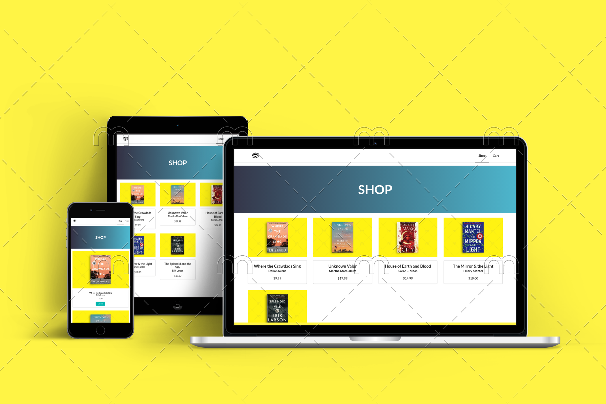

# Online Book Shop

### Projekt sklepu internetowego z panelem administracyjnym do zarządzania treścią

Funkcje zwykłego użytkownika:
- Przeglądanie produktów
- Obsługa koszyka
- Złożenie zamówienia

Funkcje administratora:
- Logowanie
- Zarządzanie zamówieniami
- Dodawanie i edycja produktów

### Wykorzystane technologie:
* Javascript
* React
* Redux
* Semantic UI
* Webpack
* Node.js
* Express.js
* MongoDB
* JSON Web Token
  
#### Sklep

#### Panel administratora

