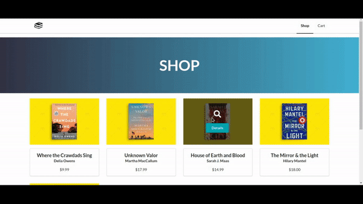
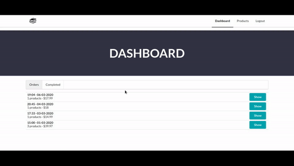
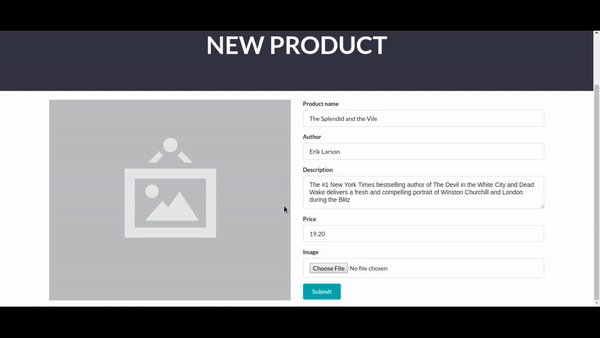

# Online Book Shop

### Projekt sklepu internetowego z panelem administracyjnym do zarządzania treścią

Funkcje zwykłego użytkownika:
- Przeglądanie produktów
- Obsługa koszyka
- Złożenie zamówienia

Funkcje administratora:
- Logowanie
- Zarządzanie zamówieniami
- Dodawanie i edycja produktów

### Wykorzystane technologie:

  

    
    JavaScript
  

  

    
    React
  

  

    
    Redux
  

  

    
    Semantic UI
  

  

    
    Webpack
  

  

    
    Node.js
  

  

    
    MongoDB
  

  

    
    JsonWebToken
  

  #### Sklep
  

  #### Panel administratora
  
  

